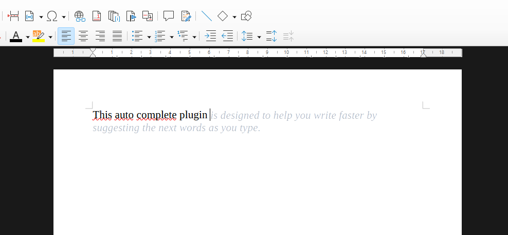

# LibreCompleteAI



Bring Cursor-style AI autocomplete to LibreOffice Writer. LibreCompleteAI helps you stay in the flow by suggesting natural prose continuations directly at the cursor, previewed as subtle ghost text you can accept with Tab or ignore by simply continuing to write.

It is built for drafting, editing, and long-form writing: essays, articles, fiction, reports, notes, and any document where the next sentence matters more than the next line of code. Use OpenAI-compatible models with your own API key, or keep everything local with Ollama.

LibreCompleteAI is a LibreOffice Writer extension that uses an LLM to continue prose at the cursor when you press Tab. It is aimed at drafting, editing, and long-form writing rather than code completion.

It is intended for LibreOffice 7.0 or newer.

## Features

- OpenAI-compatible chat completions with an API key, base URL, and model label.
- Ollama at a local or remote host, using any model you have downloaded.
- A LibreOffice settings dialog for provider and generation options.
- A compact `LC-AI` Writer toolbar with short text buttons for toggling LC-AI, continuous suggestions, completion, and settings.
- A fallback "Complete Now" command if you want to test completion without enabling the Tab hook.
- A ghost-text style preview: press Tab once to preview, press Tab again to accept.
- Optional continuous suggestions after natural writing pauses.
- Context compression for long documents, using the same selected LLM.
- Tunable context length and prediction length controls.
- A reasoning toggle, off by default, so autocomplete favors direct text generation.

## Build From Source

```powershell
python tools\build_extension.py
```

The installable extension is written to:

```text
dist/LibreCompleteAI.oxt
```

## Install

Build the extension first, or download `LibreCompleteAI.oxt` from the repository's `dist` folder.

In LibreOffice:

```text
Tools > Extension Manager > Add...
```

Choose `dist/LibreCompleteAI.oxt`, install it for the current user, and restart LibreOffice.

LibreCompleteAI's Add-ons menu commands are packaged for current-user installation. If an older test build is already installed, remove it from Extension Manager first, restart LibreOffice, then install the new `.oxt`.

You can also install from the command line on Windows:

```powershell
& "C:\Program Files\LibreOffice\program\unopkg.com" add --force --suppress-license dist\LibreCompleteAI.oxt
```

## Configure

In Writer, open:

```text
Tools > Add-ons > LC-AI Settings...
```

You can also select LibreCompleteAI in the Extension Manager and click `Options`, or open LibreOffice's normal Options dialog and choose:

```text
LibreCompleteAI > Settings
```

For OpenAI-compatible use, set:

- Provider: `OpenAI`
- API key
- Base URL, usually `https://api.openai.com/v1`
- Model label, for example `gpt-5.4-mini`, `gpt-4.1-mini`, or another model available to your account

For Ollama use, set:

- Provider: `Ollama`
- Host, usually `http://localhost:11434`
- Model label, matching a local model from `ollama list`

Generation controls:

- `Continuous autocomplete suggestions`: request suggestions in the background after you type a few new words. If you keep typing while the model thinks, LibreCompleteAI only shows the remaining ghost text when your typed words match the returned suggestion; otherwise it discards the stale suggestion and asks again from the new cursor context.
- `Allow reasoning`: off by default. When off, LibreCompleteAI asks supported providers to avoid reasoning (`think: false` for Ollama, Qwen3 `/no_think` where applicable, and the lowest reasoning effort supported by OpenAI-compatible chat completions) and strips visible thinking or meta-commentary if a model returns it anyway.
- `Context words`: how many words before the cursor should guide suggestions. Older text is compressed with the selected LLM when the context grows beyond this budget.
- `Prediction words`: the target length for each suggestion. The model is asked to stay near the target, and returned text is always capped at this many words.
- `Token cap`: the hard output token limit sent to OpenAI-compatible APIs or Ollama.

For Ollama, inline completions use the plain `/api/generate` endpoint with raw document text so local models continue the prose instead of answering a chat task. Long-context summaries still use Ollama chat.

API keys are stored locally in plain text in the user's configuration directory.

If the API key field is left empty, LibreCompleteAI can still use an `OPENAI_API_KEY` environment variable at completion time. Environment keys are not displayed or saved by the settings UI.

## Use

In Writer, use the `LC-AI` button on the LibreCompleteAI toolbar, or choose:

```text
Tools > Add-ons > Toggle LibreCompleteAI
```

The `LC-AI` button stays pressed while LibreCompleteAI is enabled for the current Writer window. The secondary toolbar buttons are available only while LC-AI is enabled. Then press Tab while the cursor is in document text. The extension sends a small amount of text before and after the cursor to the selected model, asks for a natural continuation, and shows the result as pale temporary text at the cursor.

For automatic background suggestions, use the `Continuous` toolbar button, or choose:

```text
Tools > Add-ons > Toggle Continuous Suggestions
```

The `Complete` toolbar button asks for one suggestion immediately. `Settings` opens the LC-AI settings dialog.

When a preview is visible:

- Press Tab again to accept it.
- Press Right Arrow to accept the next ghost-text character.
- Press Ctrl+Right Arrow to accept the next ghost-text word.
- Press Esc to dismiss it.
- After dismissing with Esc, press Tab again for a fresh alternative. LC-AI varies the retry direction, remembers a short bounded history of rejected suggestions, and keeps the configured prediction-length target unchanged.
- Keep typing to dismiss it and continue with your own text.

While enabled, plain Tab is consumed by the extension. Toggle LibreCompleteAI off to restore Writer's normal Tab behavior.

The compact text toolbar is docked near the top of Writer. If it does not refresh after upgrading, restart LibreOffice once after reinstalling the `.oxt`.

## Notes

LibreOffice Writer does not expose a native Cursor-style ghost text overlay through the simple macro API used here. This extension works around that by inserting tracked, temporary, pale text and deleting or committing it on the next key action.

Because the preview is temporarily real document text, dismiss or accept it before saving. Toggling LibreCompleteAI off also removes any active preview. Manual Tab completions run synchronously, so Writer may pause briefly while the model responds; continuous suggestions run in the background.
